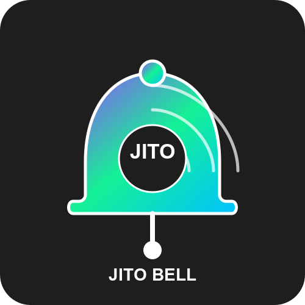

# Jito Bell

[](https://github.com/jito-foundation/jito-bell/actions)
[](https://opensource.org/licenses/Apache-2.0)
[](http://makeapullrequest.com)

<p align="center">
  
</p>

## Overview

- Track live Solana transactions
- Send notification to several destination (Slack, Telegram, Discord)

## How It Works

Jito Bell monitors Solana transactions in real-time, focusing on SPL Stake Pool and Jito Vault activities, and sends notifications when significant events occur.

### Transaction Monitoring Flow

1. Transaction Subscription
  - Jito Bell connects to a Solana RPC endpoint and subscribes to transaction stream
  - The system filters for transactions involving the SPL Stake Pool program (SPoo1Ku8WFXoNDMHPsrGSTSG1Y47rzgn41SLUNakuHy) and Jito Vault program (Vau1t6sLNxnzB7ZDsef8TLbPLfyZMYXH8WTNqUdm9g8)
  - Each transaction is captured as it occurs on the blockchain

2. Transaction Processing
  - Raw transaction information is received from the RPC
  - The parser analyzes each transaction to identify specific types:
    - For SPL Stake Pool: IncreaseValidatorStake, DepositStake, WithdrawStake, DepositSol, WithdrawSol, DecreaseValidatorStakeWithReserve
    - For Jito Vault: MintTo, EnqueueWithdrawal
  - Transaction data is decoded to extract relevant information like amount, accounts involved

3. Event Filtering
  - Configurable thresholds determine which transactions trigger notifications
  - Examples of noteworthy events:
      - Large deposits (e.g., over 1000 SOL)
      - Significant withdrawals

4. Notification Dispatch
  - When a transaction meets notification criteria, alerts are sent to configured destinations
  - Support notification channels:
    - Slack
    - Discord
    - Telegram

### Configuration
The system is highly configurable through the `jito_bell_config.yaml` file:

Set different notification thresholds for various transaction types
Configure multiple notification destinations with different filtering rules
Customize notification formats and information included
Define which program instructions to monitor

## Programs

### [SPL Stake Pool](https://github.com/solana-program/stake-pool/blob/main/program/src/lib.rs)

- Program ID: SPoo1Ku8WFXoNDMHPsrGSTSG1Y47rzgn41SLUNakuHy
- JitoSOL: J1toso1uCk3RLmjorhTtrVwY9HJ7X8V9yYac6Y7kGCPn


#### Instructions

- [IncreaseValidatorStake](https://github.com/solana-labs/solana-program-library/blob/b7dd8fee93815b486fce98d3d43d1d0934980226/stake-pool/program/src/instruction.rs#L194-L199)
- [DepositStake](https://github.com/solana-program/stake-pool/blob/0740ef57b0cd202e948641545c2761557cc8c794/program/src/instruction.rs#L299)
- [WithdrawStake](https://github.com/solana-program/stake-pool/blob/0740ef57b0cd202e948641545c2761557cc8c794/program/src/instruction.rs#L337)
- [DepositSol](https://github.com/solana-program/stake-pool/blob/0740ef57b0cd202e948641545c2761557cc8c794/program/src/instruction.rs#L378)
- [WithdrawSol](https://github.com/solana-program/stake-pool/blob/0740ef57b0cd202e948641545c2761557cc8c794/program/src/instruction.rs#L405)
- [DecreaseValidatorStakeWithReserve](https://github.com/solana-labs/solana-program-library/blob/b7dd8fee93815b486fce98d3d43d1d0934980226/stake-pool/program/src/instruction.rs#L542-L547)

### [Jito Vault Program](https://github.com/jito-foundation/restaking)

- Program ID: Vau1t6sLNxnzB7ZDsef8TLbPLfyZMYXH8WTNqUdm9g8


#### Instructions

- [MintTo](https://github.com/jito-foundation/restaking/blob/623b1816b9a93e3678c29c426e9b38ef2f324554/vault_sdk/src/instruction.rs#L132-L135)
- [EnqueueWithdrawal](https://github.com/jito-foundation/restaking/blob/623b1816b9a93e3678c29c426e9b38ef2f324554/vault_sdk/src/instruction.rs#L149-L151)

## Getting Started

### Create Webhook URL

If you don't know how to create it, you can follow [Webhook Integration Guide](https://github.com/jito-foundation/jito-bell/wiki/Webhook-Integration-Guide).

### Create `.env` file

```bash
cp .env.example .env
```

### Create ` jito_bell_config.yaml`

```bash
cp jito_bell_config_example.yaml jito_bell_config.yaml
```

### Build

```bash
docker build -t jito-bell .
```

### Run

```bash
docker run jito-bell \
  -e "https://your-endpoint.com" \
  -x-token "your-token-here" \
  -account-include SPoo1Ku8WFXoNDMHPsrGSTSG1Y47rzgn41SLUNakuHy \
  -config-file /etc/jito-bell/jito_bell_config.yaml
```

## References
- https://github.com/rpcpool/yellowstone-grpc/blob/master/examples/rust/src/bin/tx-blocktime.rs

## License

This project is licensed under the Apache License 2.0 - see the [LICENSE](LICENSE.txt) file for details.
